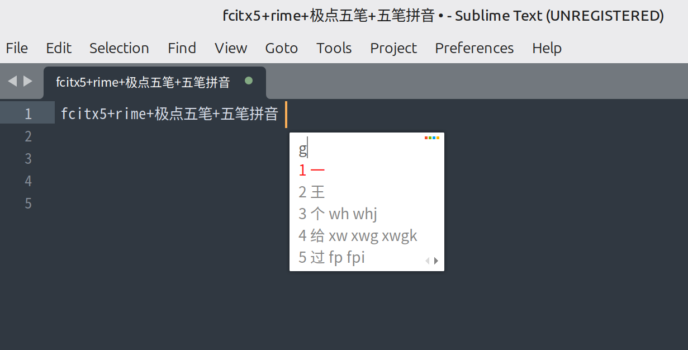

Linux(ubuntu/mint)

### run with python3
`python3 ssfconv.py -t fcixt5 sougou.ssf sougout_output`

copy sougout_output folder to   fcitx5/themes/sougout_output

### requirements:
`pip install Pillow`

### screenshot:

